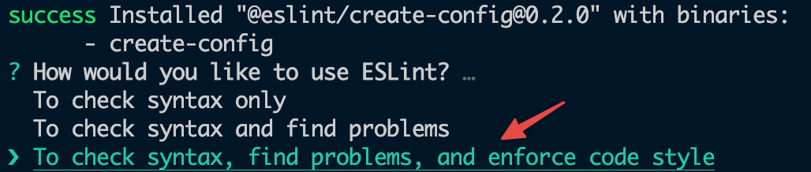
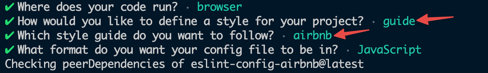
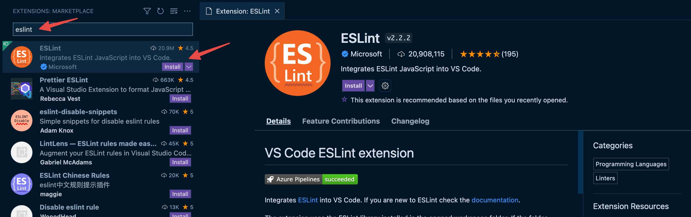
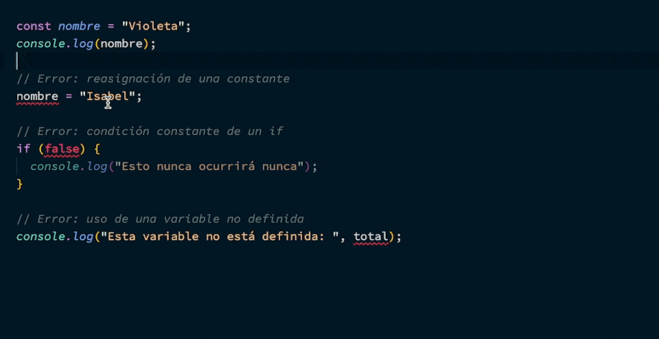

# Cómo configurar ESLint

ESLint se puede instalar y ocupar durante el desarrollo de un proyecto de
software. También se puede integrar a un editor de texto como VSCode.

## Instalación en tu proyecto

Primero instala el paquete `eslint` ejecutando en tu terminal:

```bash npm2yarn
npm install --save-dev eslint
```

Si tu proyecto no dispone de un archivo de configuración, ej. `.eslintrc.js`,
créalo con el siguiente comando:

<Tabs>
<TabItem value="npm">

```bash
npm init @eslint/config
```

</TabItem>
<TabItem value="Yarn">

```bash
yarn create @eslint/config
```

</TabItem>
</Tabs>

Esto abre un tutorial interactivo en tu terminal que debes completar indicando
las características de tu proyecto para crear la configuración inicial.

:::info

Sugerencias para el tutorial:

- Cuando te pregunte por qué uso quieres para ESLint, selecciona la opción **“To
  check syntax, find problems, and enforce code style”** para así obtener más
  ayudas:

  

- Selecciona la opción de módulos de JavaScript (import/export) a menos que tu
  proyecto importe módulos usando `require`

- Cuando te pregunte por _framework_, selecciona la opción **“None of these”**,
  a menos que estés usando React o Vue

- Cuando te pregunte por una guía de estilos, selecciona la opción de seguir una
  guía y puedes simplemente seleccionar **“Airbnb”**. Aunque también existen
  otras, Airbnb es una de las más usadas

  

- Cuando te pregunte por instalar dependencias adicionales, selecciona la opción
  para instalarlas inmediatamente

:::

Crea el archivo `.eslintignore`, si aún no existe, y agrega algunas carpetas que
usualmente queremos excluidas del análisis:

```rc title=".eslintignore"
node_modules/
dist/
build/
```

Con la configuración de ESLint lista, ahora agrega lo siguiente en tu
`package.json`, dentro de `scripts`, para ejecutar el análisis de código desde
la terminal:

```json title="package.json"
{
   ...
   "scripts": {
      ...
      "lint": "eslint ."
   }
   ...
}
```

Finalmente, ejecuta en tu terminal lo siguiente para que el linter haga el
análisis de todo tu proyecto:

<Tabs>
<TabItem value="npm">

```bash
npm run lint
```

</TabItem>
<TabItem value="Yarn">

```bash
yarn lint
```

</TabItem>
</Tabs>

## Integración con Prettier

Si instalas ESLint y Prettier juntos, es probable que tengas algunas colisiones
entre errores de ESLint y el formateo de Prettier.

La integración con Prettier consiste en instalar dos nuevas dependencias:

1. el paquete `eslint-config-prettier` para que el formateo no colisione con
   ESLint
2. el paquete `eslint-plugin-prettier` para mostrar los errores de formateo en
   los reportes de ESLint.

Primero instala el paquete `eslint-config-prettier` para desactivar las reglas
de ESLint que colisionan con el formateo de Prettier

```bash npm2yarn
npm install --save-dev eslint-config-prettier
```

Luego instala el paquete `eslint-plugin-prettier` para que los errores de
formateo de Prettier salgan en los reportes de ESLint:

```bash npm2yarn
npm install --save-dev eslint-config-prettier
```

Ahora actualiza tu `.eslintrc.json`:

- Para incorporar las configuraciones que trae `eslint-config-prettier` agrega
  `"prettier"` en `extends`.
- Para registrar los errores de Prettier como errores de ESLint agrega
  `"prettier"` en `plugins` y especifica el tipo de reporte como `"error"`:

```js title=".eslintrc.js"
module.exports = {
  // Si ya extiendes otras configuraciones, asegúrate que "prettier" esté al final
  extends: ["prettier"],

  // Si ya tienes otros plugins, asegúrate que "prettier" esté al final
  plugins: ["prettier"],
  rules: {
    "prettier/prettier": ["error"],
  },
};
```

Terminando estos pasos ya tendrás ESLint y Prettier funcionando bien en
conjunto. 🚀

## Integración con VSCode

Puedes configurar ESLint para que se integre a VSCode.

:::tip

Con esto podrás obtener reportes de errores directamente en el editor.

:::

Primero, instala la extensión de ESLint en VSCode.



Asegúrate de tener ESLint _deshabilitado_ como formateador de texto. De esta
forma evitarás colisiones con otros formateadores como Prettier.


Ahora ya debieras tener ESLint correctamente configurado y entregando reportes
de errores directo en el código.


