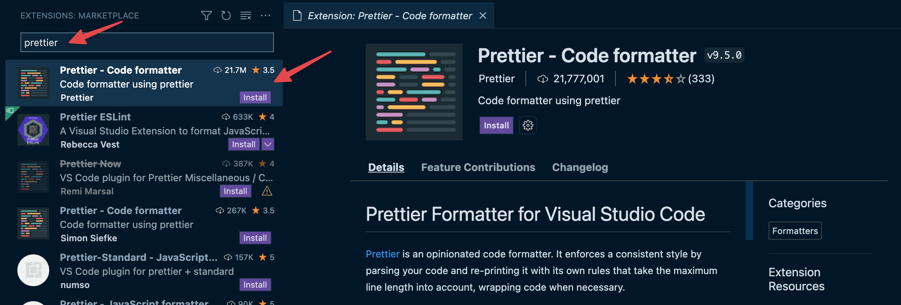
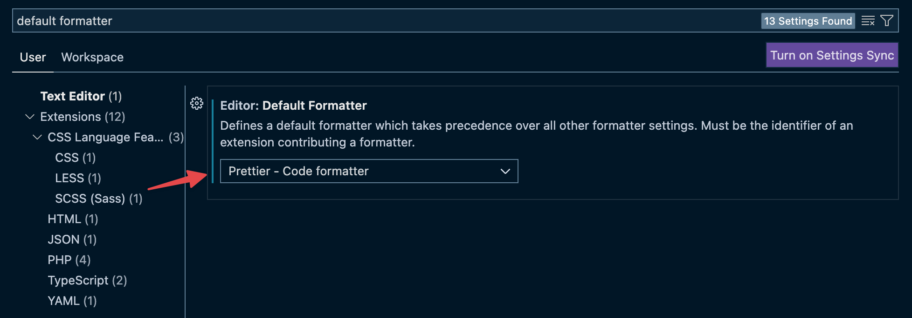
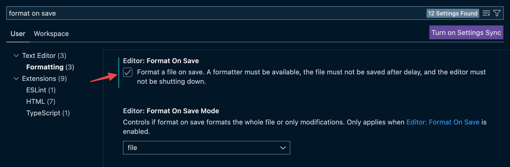
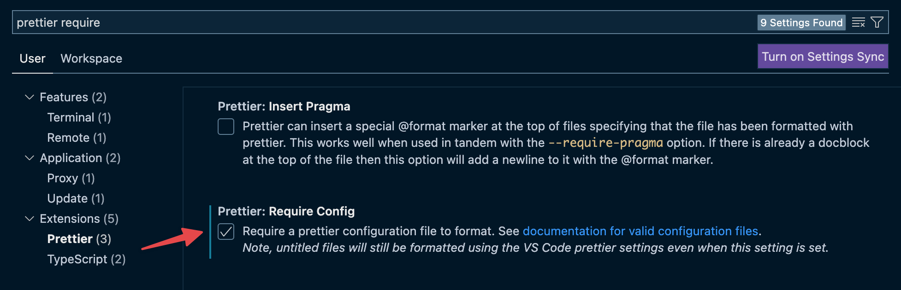

# Cómo configurar Prettier

Para instalar y ocupar Prettier en tu proyecto e integrarlo a VSCode, sigue las
instrucciones en las secciones a continuación.

## Instalación en tu proyecto

1. Instala el paquete `prettier` ejecutando lo siguiente en tu terminal:

   ```bash npm2yarn
   npm install --save-dev prettier
   ```

2. Crea el archivo `.prettierrc.json` y agrega un objeto vacío para usar las
   configuraciones por defecto:

   ```json title=".prettierrc.json"
   {}
   ```

3. Crea el archivo `.prettierignore` y escribe la ruta `node_modules/` dentro
   para que esta carpeta no se incluya en el formateo de código:

   ```rc title=".prettierignore"
   node_modules/
   ```

4. Para ejecutar el formateo desde la terminal, agrega en tu `package.json`,
   dentro de `scripts`, lo siguiente:

   ```json title="package.json"
   "format": "prettier --write ."
   ```

5. Finalmente, ahora puedes arreglar el formato de todos tus archivos ejecutando
   lo siguiente en tu terminal:

   ```bash npm2yarn
   npm run format
   ```

## Integración con VSCode

Sigue los siguientes pasos para que Prettier funcione automáticamente en VSCode:

1. Instala la extensión de Prettier en VSCode:

   

2. Habilita Prettier como el formateador por defecto bajo **Text Editor** en las
   configuraciones de VSCode para asegurarte de usar este programa para el
   formateo de código:

   

3. Activa la opción “Format On Save” bajo **Text Editor > Formatting** para que
   Prettier ajuste el formateo del código cada vez que guardes un archivo:

   

4. Finalmente, activa la opción “Require Config” de la extensión de Prettier
   para que solo se aplique el formateo de código si existe un archivo de
   configuración, ej. `.prettierrc.json`, y así evitar posibles confusiones con
   reglas de formateo:

   

Terminando el último paso Prettier debiera formatear automáticamente el código
cada vez que guardes el contenido de un archivo.
