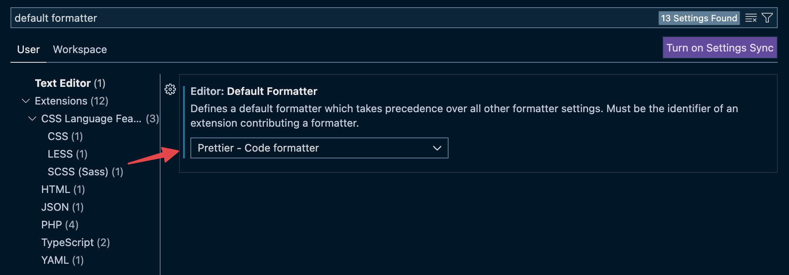
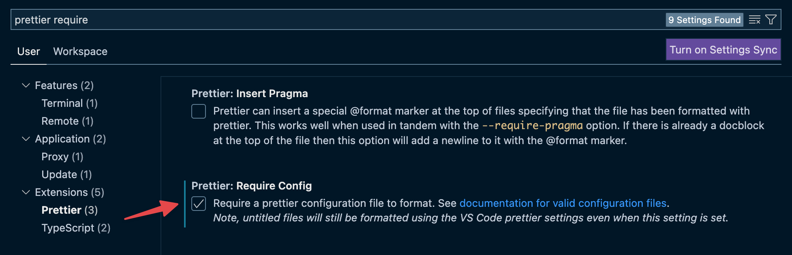

# Cómo configurar Prettier

Prettier se puede instalar y ocupar durante el desarrollo de un proyecto de
software. También se puede integrar a un editor de texto como VSCode.

## Instalación en tu proyecto

Primero instala el paquete `prettier` ejecutando en tu terminal:

```bash npm2yarn
npm install --save-dev prettier
```

Crea el archivo `.prettierrc.json` y agrega un objeto vacío para usar las
configuraciones por defecto:

```json title=".prettierrc.json"
{}
```

Crea el archivo `.prettierignore` y agrega algunas rutas que no necesitamos que
sean incluidas en el formateo automático:

```rc title=".prettierignore"
node_modules/
dist/
build/
```

Para ejecutar el formateo desde la terminal, agrega en tu `package.json`, dentro
de `scripts`, lo siguiente:

```json title="package.json"
{
   ...
   "scripts": {
      ...
      "format": "prettier --write ."
   }
   ...
}
```

Finalmente, ahora puedes arreglar el formato de todos tus archivos ejecutando lo
siguiente en tu terminal:

```bash npm2yarn
npm run format
```

## Integración con VSCode

Puedes configurar Prettier para que se integre a VSCode.

:::tip

Con esto podrás aplicar el formateo de código automáticamente cada vez que
guardes el contenido de un archivo.

:::

Primero, instala la extensión de Prettier en VSCode.


Luego, habilita Prettier como el formateador por defecto bajo **Text Editor** en
las configuraciones de VSCode para asegurarte de usar este programa para el
formateo de código.



Activa la opción “**Format On Save**” bajo **Text Editor > Formatting** para
habilitar que Prettier ajuste el formateo del código cada vez que guardes un
archivo.


Finalmente, activa la opción “**Require Config**” de la extensión de Prettier
para que solo se aplique el formateo de código cuando existe un archivo de
configuración, ej. `.prettierrc.json`. De esta forma evitarás posibles
confusiones con reglas de formateo que no estén habilitadas explícitamente.



Terminando el último paso Prettier debiera formatear automáticamente el código
cada vez que guardes el contenido de un archivo.
